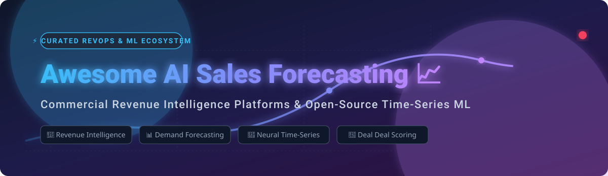

# Awesome-AI-Sales-Forecasting 📈 🤖

  

  
  
  
  
  
  

---

## 🌟 Top AI Sales Forecasting & Revenue Intelligence Ecosystem 🚀

**Curated List of Commercial Revenue Intelligence Platforms, AI Sales Forecasting Tools & Open-Source Time-Series ML Libraries**  
*Focused on Pipeline Analytics, Predictive Deal Scoring, AI Revenue Operations (RevOps), Demand Forecasting, Time-Series Deep Learning & Self-Hosted AI Models*

**Last updated: October 2026** 📅

---

### 📌 Overview & Market Analysis 🔍

Welcome to the definitive curated directory of **AI sales forecasting software**, **revenue intelligence platforms**, and **open-source time-series machine learning models**. Whether you are looking for enterprise-grade SaaS platforms (*Salesforce Sales Cloud Einstein*, *Gong*, *Clari*, *Outreach*), or self-hostable open-source frameworks (*sktime*, *Kats*, *Facebook Prophet*, *Nixtla NeuralForecast*, *Darts*), this directory provides comprehensive benchmark insights, pricing details, and architectural options for revenue operations (RevOps) teams and machine learning engineers.

#### 📊 Market Size & Structure Analysis 💡
- **Estimated Market Size**: The global **AI Sales Forecasting & Revenue Intelligence market** is estimated at **$5.2 Billion in 2026**, growing at a CAGR of **18.4%** towards **$11.8 Billion by 2030**.
- **Market Concentration & Dynamics**: The market is **moderately fragmented**, exhibiting strong consolidation at the enterprise layer while retaining specialized innovation niches. 
  - **Enterprise Layer (Consolidated)**: **Salesforce**, **Gong**, and **Salesloft/Clari** control significant market share through ecosystem lock-in and CRM integration.
  - **Mid-Market & Specialized (Fragmented)**: High competition exists across conversation intelligence, AI-assisted FP&A planning (Anaplan, Pigment), and lightweight RevOps layers (Forecastio).

**Key Industry Highlights (2026):**
- **Salesforce leads the 2026 ISG Revenue Intelligence Buyers Guide** with an overall score of **82.0%**, followed by **Gong (79.0%)** and **Salesloft (78.2%)** [citation:13]. **Gong, Outreach, Salesforce, and Salesloft** were rated **Exemplary**, with **Aviso and Clari** rated **Innovative** [citation:13].
- **Clari Forecast** is sold **quote-only on annual contracts** for enterprise revenue operations teams [citation:9].
- **Nixtla's NeuralForecast** and **sktime** dominate open-source time-series forecasting with state-of-the-art deep learning architectures [citation:3][citation:15].

---

## 📑 Table of Contents 📖
- [🏢 SaaS & Commercial Platforms](#-saas--commercial-platforms)
- [🔓 Open-Source GitHub Projects](#-open-source-github-projects)
- [🛠️ How to Contribute](#%EF%B8%8F-how-to-contribute)
- [📊 Star History](#-star-history)
- [🤝 Support & Sponsorship](#-support--sponsorship)
- [⚠️ Disclaimer](#%EF%B8%8F-disclaimer)

---

## 🏢 SaaS / Commercial Platforms 💼

*Sorted by Valuation / Company Size (Descending)* 📉

| SaaS / Commercial Platform | Company / Owner | Valuation / Company Size | Standard Edition Starting Price | Free Tier / Free Trial Limits | Description |
| :--- | :--- | :--- | :--- | :--- | :--- |
| **[Salesforce Sales Cloud Einstein](https://www.salesforce.com/)** ☁️ | Salesforce | **~$250 Billion** (Public) | **$25/user/month** (Starter Suite; Pro Suite $100/mo, Enterprise ~$165/mo) | **30-day free trial** (no credit card required; core CRM access) | **CRM-native forecasting** — **Einstein forecasting, deal insights, and pipeline analytics run natively on CRM data**. **No second platform to sync** [citation:9]. **Overall ISG 2026 Leader with 82.0%** [citation:13]. 🏆 |
| **[HubSpot Sales Hub](https://www.hubspot.com/)** 🟠 | HubSpot | **~$30 Billion** (Public) | **$100/seat/month** (Professional tier required for forecasting) | **Free-forever tier** (max 2 users, 1,000 contacts, 1 pipeline) or **14-day free trial** for Pro features | **CRM-native forecasting** — **Weighted-pipeline and category forecasts, manager submissions, and goal tracking**. **Adoption-friendly UX reps actually keep current** [citation:17]. **Limitation: no real accuracy-feedback loop, light scenario tooling** [citation:17]. 📊 |
| **[Anaplan](https://www.anaplan.com/)** 🏢 | Anaplan | **~$10 Billion** (Private / Thoma Bravo) | **~$30,000 to $50,000/year minimum** entry license | **No free tier/trial for enterprise product** (90-day learning access available via Talent Builder for students) | **Connected planning platform** — **Sales forecast as one face of an enterprise model covering territories, quotas, headcount, and finance**. **Change a hiring assumption and watch the revenue line move** [citation:17]. **Implementations run months; model needs a permanent owner** [citation:17]. 🏛️ |
| **[Gong](https://www.gong.io/)** 🎯 | Gong | **~$7.2 Billion** (Private) | **~$1,300 to $1,600/user/year** + mandatory annual platform fee ($5,000–$50,000) | **No free tier**; no self-serve free trial (sales-led pilot/demo required) | **Revenue intelligence platform** — **Records every sales call, surfaces deal risks, and auto-populates CRM from conversation data**. **Used by 5,000+ companies** [citation:9]. **Rated Exemplary in ISG 2026 Buyers Guide** [citation:13]. 🎙️ |
| **[Outreach](https://www.outreach.io/)** 🟢 | Outreach | **~$4.4 Billion** (Private) | **~$100 to $160/user/month** (annual contract required) | **No free tier**; no public free trial (sales-led demo required) | **Sales execution platform** — **Sequencing, deal management, conversation intelligence, and forecasting in one system** [citation:9]. **Rated Exemplary in ISG 2026** [citation:13]. ⚡ |
| **[Clari (Salesloft)](https://www.clari.com/)** 🔷 | Salesloft | **~$2.6 Billion** (Private) | **~$100 to $120/user/month** (annual contract; quote-only) | **No free tier**; no self-serve free trial (guided sales pilot only) | **Enterprise forecasting and pipeline product** — **Builds forecast from system signals rather than figures reps type into CRM**. **Pipeline analytics, AI forecast predictions, deal inspection, and forecast variance tracking** [citation:9]. **Rated Innovative in ISG 2026** [citation:13]. 💎 |
| **[Pigment](https://www.pigment.com/)** 🎨 | Pigment | **~$1.0 Billion** (Private / Unicorn) | **~$30,000 to $50,000/year minimum** starting entry deployment | **No core free tier**; **14-day free trial for AI-powered modeling environment** | **Modern finance-led planning** — **Finance-grade planning models with dramatically better build experience than Anaplan**. **Sales forecasting logic is build-your-own** [citation:17]. 🎨 |
| **[Revenue.io](https://www.revenue.io/)** 🟣 | Revenue.io | **~$200 Million** (Private) | **~$75 to $100/user/month** (Activate tier estimate) | **No free tier for main platform**; **Free trial of Revenue Roleplay** (100 AI roleplay sessions free) | **Revenue operations platform** — **Conversation intelligence and forecasting**. **Rated Assurance in ISG 2026** [citation:13]. 📞 |
| **[Aviso](https://www.aviso.com/)** 🔵 | Aviso | **~$150 Million** (Private) | **Quote-based per-seat pricing** (typically custom enterprise quotes) | **No free tier**; no self-serve free trial (sales-led demo/proposal only) | **AI revenue intelligence** — **Forecasting and pipeline management**. **Rated Innovative in ISG 2026** [citation:13]. 🔮 |
| **[Forecastio](https://forecastio.ai/)** 📊 | Forecastio | **~$10 Million** (Private / Early-Stage) | **$249/month** (or $149/mo annual) | **14-day free trial** (also offers 1-month free pilot program) | **Focused, affordable forecasting layer** — **For SMB and mid-market teams on HubSpot or Salesforce**. **Setup is days, models cover weighted pipeline and quota pacing** [citation:17]. **Best for 10-to-40-rep teams drowning in spreadsheet forecasts** [citation:17]. 🚀 |

---

## 🔓 Open-Source GitHub Projects 🤖

*Sorted by GitHub Stars Count (Descending)* 🌟

- **[Darts (unit8co)](https://github.com/unit8co/darts)**   
  **A Python library for easy manipulation and forecasting of time series**, LGPL-3.0 licensed. **8,120+ GitHub stars** — **features a scikit-learn-like API for everything from ARIMA to Deep Learning models like N-BEATS, TFT, and Chronos**. 🎯

- **[sktime](https://github.com/sktime/sktime)**   
  **A unified framework for machine learning with time series**, BSD-3-Clause licensed. **7,696+ GitHub stars** — **the most comprehensive open-source framework for time series forecasting, classification, and regression** [citation:15]. **Provides a unified API for multiple time series learning tasks**. **Includes forecasting, classification, and regression algorithms**. 🏛️

- **[Kats (Facebook)](https://github.com/facebookresearch/Kats)**   
  **A kit to analyze time series data**, MIT licensed. **4,896+ GitHub stars** — **lightweight, easy-to-use, generalizable, and extendable framework to perform time series analysis, from key statistics to forecasting future trends** [citation:11]. 🐱

- **[sktime pytorch-forecasting](https://github.com/sktime/pytorch-forecasting)**   
  **Time series forecasting with PyTorch**, MIT licensed. **3,883+ GitHub stars** — **PyTorch-based probabilistic time series forecasting framework based on GluonTS backend** [citation:11][citation:15]. 🔥

- **[NeuralProphet](https://github.com/ourownstory/neural_prophet)**   
  **A simple neural forecasting package**, MIT licensed. **3,828+ GitHub stars** — **combines Prophet's usability with PyTorch neural network performance** [citation:15]. 🧠

- **[Nixtla NeuralForecast](https://github.com/Nixtla/neuralforecast)**   
  **Scalable and user-friendly neural forecasting algorithms**, Apache-2.0 licensed. **3,454+ GitHub stars** — **the leading open-source neural forecasting library** [citation:3]. **Implements state-of-the-art deep learning models including N-BEATS, NHITS, TFT, and PatchTST** [citation:19]. ⚡

- **[Merlion (Salesforce)](https://github.com/salesforce/Merlion)**   
  **A Machine Learning Framework for Time Series Intelligence**, Apache-2.0 licensed. **3,363+ GitHub stars** — **unified interface for forecasting, anomaly detection, and change point detection** [citation:11]. 🦁

- **[GluonTS (AWS)](https://github.com/awslabs/gluonts)**   
  **Probabilistic time series modeling in Python**, Apache-2.0 licensed. **3,250+ GitHub stars** — **Amazon's deep learning library for time series forecasting built on PyTorch and MXNet**. ☁️

- **[Chronos](https://github.com/lamadelrae/chronos)**   
  **Demand forecasting and sales analytics platform**, open-source. **Predicts product demand using machine learning based on historical sales data** [citation:4]. **Sales Analytics Dashboard with real-time metrics**. 📈

- **[Book-Keeping AI](https://github.com/souvik03-136/book-keeping-ai)**   
  **AI-powered bookkeeping and demand forecasting**, open-source. **Transaction entity extraction and async Celery forecast execution** [citation:12]. 📊

- **[Sales Forecast MLOps at Scale](https://github.com/jomariya23156/sales-forecast-mlops-at-scale)**   
  **Full-stack cloud-native machine learning system for demand forecasting**, open-source. **Real-time streaming and automated retraining loop** [citation:6]. 🚀

- **[AI Inventory for ERPNext](https://github.com/tbocloud/ai_inventory)**   
  **AI-powered forecasting toolkit for ERPNext**, open-source. **Predictive insights across Inventory, Sales, and Finance** [citation:16]. 📦

- **[Auto Forecast](https://github.com/mollyryanruby/auto_forecast)**   
  **Automated sales forecasting package**, open-source [citation:10]. 🛠️

---

## 🛠️ How to Contribute 🤝

Contributions are welcome! Follow these steps to submit new sales forecasting platforms or open-source forecasting software:

1. 🍴 **Fork** the repository.
2. 📝 **Add/edit** entries in `README.md` maintaining table/list structure and formatting.
3. 🔗 Include project title, official website/GitHub link, exact Stars Count badge, license, and brief description.
4. 🚀 Submit a **Pull Request** with a descriptive summary of your changes.

---

## 📊 Star History

---

## 🤝 Support & Sponsorship 💖

If you find this AI sales forecasting repository useful, please consider supporting the project:

- ⭐ **Star** this repository to increase visibility!
- 🔀 **Fork** and share with fellow revenue operations leaders, sales analysts, and open-source advocates.
- ☕ **Sponsor & Buy Me a Coffee**: Support ongoing open-source curation via the [GitHub Sponsor Dashboard](https://github.com/sponsors/ishandutta2007).

---

## ⚠️ Disclaimer 🔒

- This is a **community-curated** list — not exhaustive and not an endorsement. ℹ️
- **Salesforce leads the 2026 ISG Revenue Intelligence Buyers Guide** with **82.0% overall**, followed by **Gong (79.0%)** and **Salesloft (78.2%)** [citation:13].
- **Enterprise pricing is often quote-only and opaque** — **Clari Forecast is sold quote-only on annual contracts** [citation:9].
- **Open-source forecasting tools are not turnkey** — **sktime and Nixtla NeuralForecast require Python and ML expertise**. Always validate forecast accuracy with a proof-of-concept. 📈

---

  <b>Made with ❤️ for revenue operations leaders, sales analysts, and open-source forecasting advocates.</b>

